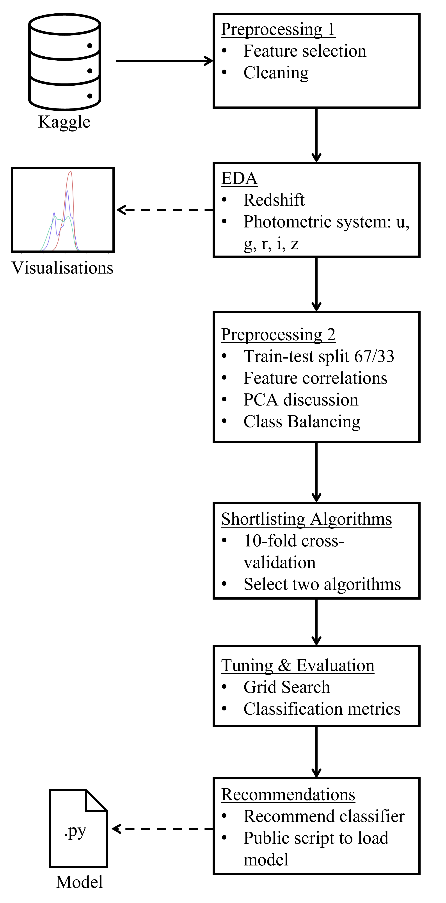

# Astronomical Object Classification from The Sloan Digital Sky Survey's Seventeenth Data Release
## Intro
This repo is for my Data Science MSc dissertation on exploratory  data analysis and classification of the SDSS DR17.

SDSS DR17 is the latest data release from a sky survey. Sky surveys catalogue objects in the Univserse.
The three objects of interest are Galaxy, Quasar (QSO) and Star.

Data from Kaggle: https://www.kaggle.com/datasets/fedesoriano/stellar-classification-dataset-sdss17
My code is a series of Python notebooks exploring the dataset and building
a classifier.

## Repo Breakdown
* StellarEDA.ipynb is Data Vis and EDA.
* PCA.ipynb uses PCA to explore its effectiveness for this data
* StellarShortlist.ipynb uses CV to estimate and compare classifier algorithms
* PipelineTuning.ipynb is Grid Search to investigate hyperparam combinations
* FinalPipeline.ipynb is the test set evaluation with confusion matrix
* data/ contains class balanced and raw datasets
* img/ contains figures
* model/ contains script to load my recommended model

## Project Workflow and Dissertation Overview:

Model too large to push to GitHub so can dowload here:
https://drive.google.com/drive/folders/1a0T1jDLMTgfBx1qavTaVnuLmL8G4ydKr?usp=sharing
